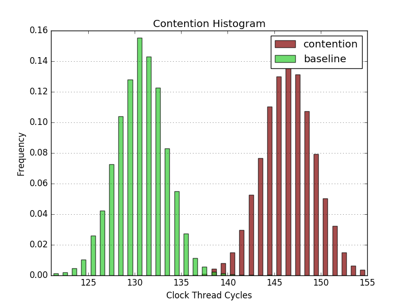
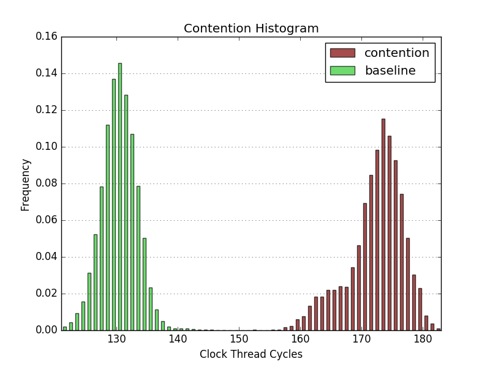
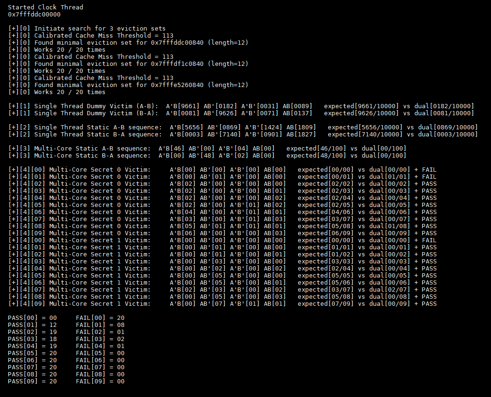
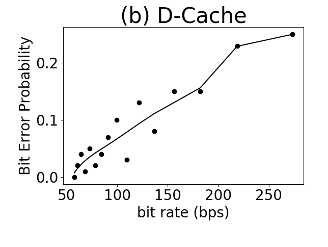

# DCU POC

This will be a guide on how to run the dcache_poc.

## Step 1: Observing Contention Effects

As a preliminary step we will take a look at the observed contention effects of the given construction used by dcache_poc on the current machine being tested.

### Prerequisites

Before we begin run the initial script as before:

```
chmod +x run-first.sh
sudo ./run-first.sh
```

### Generating Contention Histograms

The objective of this step is to observe the extent of contention caused by the VSQRTPD dependency chain used in the POC as well as the noise of the current running environment.

We will be working in the **./contention** directory.

Follow these steps to generate the histogram (depicted in Figure 9 of the paper) that compares the execution time of a load that is data-dependent on a VSQRTPD dependency chain in the presence of immediate subsequent contending instructions (independent ready-to-fire VSQRTPD instructions) and absence of contention (NOPs).

Note: Before compiling the testbench, the fields **HT1** and **HT2** need to be defined in contention.c. **HT1** is the cpuid of the clock thread used for timing, while **HT2** is the cpuid of the main thread. These need to be set to cpuids of two sibling hyperthreads. To find sibling hyperthreads for a given cpuid (cpu0 for example) one can execute the following:

```
cat /sys/devices/system/cpu/cpu0/topology/thread_siblings_list
```

If the current machine does not support SMT, one can also run under different cores, however the timing measured by the clock_thread might have added noise.

Note: There is a configurable parameter in contention.c which determines the length of subsequent contending instructions. This is the value following **.REPT** commented as **"CON_LOOPS"**. By default this is set to 1, however we will also run the test using 10 iterations.

Once **HT1**, **HT2**, and **CON_LOOPS** are set, to generate the histogram run:

```
cd ./contention
gcc -std=gnu99 -O3 contention.c -lpthread -o con 
./con > raw.csv
python3 plotContention.py
```

Subsequent runs with updates to **contention.c** can be done simply using:

```
gcc -std=gnu99 -O3 contention.c -lpthread -o con && rm raw.csv && ./con > raw.csv && python3 plotContention.py
```

Below we have histograms showing sufficient contention to run the dcache_poc on our machine. 

For CON_LOOPS == 1:


For CON_LOOPS == 10:


Note: The X-axis is clock-thread cycles, to convert to rdtsc cycles one can time using rdtsc a number of clock-thread ticks and determine the conversion ratio. For our tests there is approx 4.92 rdtsc cycles per clock-thread tick.

If the contention histograms do not indicate a clean seperation in execution times, background processes need to terminated and preferably ubuntu be run in non-gui mode if not already. 


## Step 2: Identifying Replacement Policy

In this step we will identify the cache replacement policy of the current machine.

### Step-by-Step

We will use the nanoBench tool set to identify the replacement policy. Note [uops.info](https://uops.info/cache.html) is a good reference for replacement policies across different intel core generations. This POC is developed with a priming and probing sequence that is compatible with **QLRU_H11_M1_R0_U0**. It may not be compatible with other quad-age LRU policies.

I would recommend verifying using [uops.info](https://uops.info/cache.html) and continuing to the next step. This is a good step to refer back to when debugging issues with the POC. 

Detailed guide on how to use the CacheAnalyzer is provided on the nanoBench [github](https://github.com/andreas-abel/nanoBench/tree/master/tools/CacheAnalyzer#prerequisites) page. I will give a synopsis of the steps here.

**To use the nanoBench toolset:**

```
git clone https://github.com/andreas-abel/nanoBench.git
cd ./nanoBench
make kernel
sudo insmod kernel/nb.ko
```

Note: I encountered a Permission Denied error from insmod, this was fixed by cloning the repo to /tmp/ instead. 

**To allocate memory for the CacheAnalyzer:**

```
sudo ./set-R14-size.sh 1G
```

Note: If insufficient memory is allocated a quick reboot will help.

**Reminder to run the run-first script before launching the tool (mainly to disable prefetching):**

```
sudo ./run-first.sh
```

**Run the script to disable all but one core:**

```
sudo ./single-core-mode.sh
```

Note: To later revert this, replace echo 0 with echo 1. Should auto revert with reboot as well. 

**To find replacement policy:**

```
cd ./tools/CacheAnalyzer
sudo ./replPolicy.py -level 3 -sets 0,33 -allQLRUVariants -output repl.html
```

Note: I chose specific sets 0 and 33 based on info from [uops.info](https://uops.info/cache.html) that these sets follow the vanilla **QLRU_H11_M1_R0_U0** policy.

To examine the results open **repl.html**. A sample output is avaiable here: [HSW_L3](https://uops.info/cache/replPolicy_HSW_L3.html). The tools runs several sequences of accesses and observes cache hits/misses, if the #cache-hits match the simulated #cache-hits of a given policy it's a match! Ideally the policy will match #cache hits for all sequences. 


## Step 3: Running DCU POC

Now that we have observed the desired contention effects and identified the replacement policy we can dive into running the POC. In this section we will first update machine-specific parameters for the eviction set algorithm, allocate shared memory, and finally run the different stages of POC beginning with several sanity tests leading up to the final multi-core POC. We will use the results to generate the evaluation graphs (Figure 10 in the paper).

### 3.1 Configuring Eviction Set Parameters (util.h)

In this step we will update the machine specific memory parameters referenced the POC to create eviciton sets. For each parameter in **util.h**, I added some useful linux commands to find the machine specific values. 

#### Logical cores:

**NUMBER_OF_LOGICAL_CORES**: ```lscpu```\
**NUM_PAGES**: This should match the NUM_PAGES successfully allocated by shm-crea.c. 200 pages has been a sufficient number.


#### Cache hierarchy characteristics:

**CACHE_BLOCK_SIZE**: Most likely 64B, run ```getconf -a | grep CACHE```\
**CACHE_BLOCK_SIZE_LOG**: log<sub>2</sub> of CACHE_BLOCK_SIZE

**L1_CACHE_WAYS**: ```cat /sys/devices/system/cpu/cpu0/cache/index0/ways_of_associativity```\
**L1_CACHE_SETS**: ```cat /sys/devices/system/cpu/cpu0/cache/index0/number_of_sets```\
**L1_CACHE_SETS_LOG**: log<sub>2</sub> of L1_CACHE_SETS

**L2_CACHE_WAYS**: ```cat /sys/devices/system/cpu/cpu0/cache/index2/ways_of_associativity```\
**L2_CACHE_SETS**: ```cat /sys/devices/system/cpu/cpu0/cache/index2/number_of_sets```\
**L2_CACHE_SETS_LOG**: log<sub>2</sub> of L2_CACHE_SETS

**LLC_CACHE_WAYS**: ```cat /sys/devices/system/cpu/cpu0/cache/index3/ways_of_associativity```\
**LLC_CACHE_SETS_TOTAL**: ```cat /sys/devices/system/cpu/cpu0/cache/index3/number_of_sets```\
**LLC_CACHE_SETS_PER_SLICE**: LLC_CACHE_SETS_TOTAL/LLC_CACHE_SLICES\
**LLC_CACHE_SETS_LOG**: log<sub>2</sub> of LLC_CACHE_SETS_PER_SLICE\
**LLC_CACHE_SLICES**: I don't have a linux command for this one. This should be the number of logical cores. I would recommend using [WikiChip](https://en.wikichip.org/wiki/intel/microarchitectures/) with architecture details of the current machine from ```lscpu```.


#### Set indexes:

**L1_SET_INDEX_MASK 0xFC0**: in binary *L1_CACHE_SETS_LOG 1's | CACHE_BLOCK_SIZE_LOG 0's*\
**L2_SET_INDEX_MASK 0xFFC0**: in binary *L2_CACHE_SETS_LOG 1's | CACHE_BLOCK_SIZE_LOG 0's*\
**LLC_SET_INDEX_PER_SLICE_MASK**: in binary *LLC_CACHE_SETS_LOG 1's | CACHE_BLOCK_SIZE_LOG 0's*\
**LLC_INDEX_STRIDE**: 2<sup>LLC_CACHE_SETS_LOG + CACHE_BLOCK_SIZE_LOG</sup>\
**L2_INDEX_STRIDE**: 2<sup>L2_CACHE_SETS_LOG + CACHE_BLOCK_SIZE_LOG</sup>\
**L1_INDEX_STRIDE**: 2<sup>L1_CACHE_SETS_LOG + CACHE_BLOCK_SIZE_LOG</sup>


#### Memory related constants:

**PAGE_SHIFT**: log<sub>2</sub> of PAGE\
**PAGEMAP_LENGTH**: Most likely 8B, one 8B value for each virtual page\
**PAGE**: Most likely 4096B, ```getconf PAGESIZE```


### 3.2 Preparing Shared Memory for dcache_poc

In this step we will allocate a contiguous set of physical memory pages for use by the dcache_poc to create eviction sets. 

This process, **crea**, will create **NUM_PAGES** (200) contiguous huge pages and save the shared memory ids in a file: **page_ids.txt**. The dcache_poc will then reference this file to use in eviction set creation. Once the shared memory ids are ready, they will detach from **crea**, and the process should be suspended. This will allow dcache_poc to use these shared pages later, and once dcache_poc terminates and **crea** terminates the shared memory pages will be freed. To accomplish this do the following:

```
gcc -O3 shm-crea.c -o crea
sudo ./crea
Ctrl+Z
```

Check any error messages and the pageids.txt file for **NUM_PAGES** (200) valid shared memory ids.

In the case that **crea** is not able to allocate 200 pages, a reboot is recommended. If entirely constrained, reduce the **NUM_PAGES** to the maximum value it can allocate and update **NUM_PAGES** in **util.h** to match this value.


### 3.3 Running the POC

Note: The function calls in the *dcache_poc.c* assume an LLC associativity of 12 (the machine I tested this on). There will need to be manual modifications made if this is not the case.

For an LLC associativity of 16 use the *dcache_poc16.c* instead.

Before running the dcache_poc we need to specify cpuids defined at the top of **dcache_poc.c**. If the machine does not support SMT simply assign different cpuids for **VIC**, **ATKD**, and **CLK**. If the machine does support SMT, make sure **VIC** and **ATKD** are seperate logical cores and not sibling hyperthreads. (**ATKS** was used to run an SMT version of the attack and is not currently being run so it can be safely ignored) Refer to Step 1 for how to determine sibling hyperthreads.

**To run the dcache_poc:**

```
make
gcc -std=gnu99 -o dcu obj/util.o -O3 dcache_poc16.c -lm -lrt -lpthread support.s -w
sudo ./dcu
```

A successful run of the POC outputs something similar to this:



Step [0] establishes the eviction set. Step [1] is a single-threaded dummy test which is intended to test the replacement policy. Step [2] is a single-threaded test which isolates the victim code from the attacker code. Step [3] is a multi-core test with the victim's load issue order fixed/static. Step[4] is the final POC with the victim's load issue order determined by secret dependent contention.

If the single-threaded tests are passing, the best way to tune the multi-core test is using the "CHAIN_ITER" value. For CHAIN_ITER == 0, the victim_thread acts as an A-B issue order. For CHAIN_ITER == 80+, the victim_thread acts as a B-A issue order. CHAIN_ITER needs to be tuned to the correct value to make the issue order swing one way or another based on the presence or absence of contention. Typically values between 32-46 have been successful however this can depend on many factors.

#### Result Interpretation

This will be a explanation of the output printed by the PoC. Before we begin, let's rehash the structure of the attacker-victim thread interaction. In chronological order, the attacker thread primes the replacement state of the target cache set, followed by the victim-thread generating an access to address A-B or B-A based on secret-dependent execution unit contention, and finally the attacker thread probes the cache set and times an access to A followed by an access to B. Based on a measured LLC cache hit threshold, the timed accesses to A and B can be observed as a hit or miss. If the victim issues A-B, the attacker prime-probe is designed such that only B will be a resident/cache-hit. In the case that the victim issues B-A, the expectation is for only A to be a cache-hit.

Now, the PoC runs four stages, and for a given stage the output is displayed as:

\[+\]\[i\] Stage-Description(A-B): A'B\[val\] AB'\[val\] A'B'\[val\] AB\[val\] expected\[val/total\] vs dual \[val/total\]

The stage description describes the sequence of victim issued loads (A-B or B-A). Then there are four values for A'B, AB', A'B', AB. Take A'B for example, this denotes an observed cache-miss to A and cache-hit to B by the attacker (' denotes a miss). Finally, based on the expected output, an *expected* and *dual* value is printed. Take for example a stage-description that executes A-B, in this case the expected result is A'B (only B cache hit) and the dual result is AB' (only A cache hit). A stage is successful if the expected\[\] is greater than the dual\[\].

During the Multi-Core Secret 0/1 Victim, the secret bit is set to 0/1 and the PoC is run for 1-INNER_ITER iterations. Repition is used to improve confidence of the leaked bit. With a finely tuned **CHAIN_ITER**, the PoC is expected PASS with higher accuracy (expected > dual) for higher repitions for both 0/1.


### 3.4 Evaluation

The parameters OUTER_ITER and INNER_ITER are used to increaes data points for generating bit transfer success rate. INNER_ITER is repition of the bit transfer to improve confidence, while OUTER_ITER is the number of bits being tested (total is 2*OUTER_ITER for secret bit 0 and 1). The covert channel is measured in rdtsc cycles and the success rates coupled with time to produce them and fed to ```dc_plot.py```.

#### DEFINE variables

**INNER_ITER**: Repeat the covert channel for 1,2,3, ... , INNER_ITER-1 times for each bit being transmitted. The bit is identified with success if the majority of the runs show correct behavior (expected > dual).

**OUTER_ITER**: Total bits being transmitted will be 2*OUTER_ITER.

**CPU_FREQ**: CPU frequency used to convert rdtsc cycles into seconds.

**DEBUG_CHECKPOINT_PRINT**: When set to 1, the console will print intermediate results every 2*SNAPSHOT_FREQUENCY bits.

**DEBUG_CHECKPOINT_FILE**: When set to 1, the intermediate results for every 2*SNAPSHOT_FREQUENCY bits will be saved in a log file called **checkpoint.txt**.

**SNAPSHOT_FREQUENCY**: How often debug snapshots are taken in bits/2.

#### Generating Figure 10

With the desired parameters set, upon termination the PoC will output a csv file called *dcache*, that will list bits/s against error-rate. This will be the input to ```dc_plot.py``` and ```dcu_pareto.py```. The code is not fully optimized for running large number of bits continuously due to the overhead of *pthread_create()* and *pthread_exit()* for each bit attempting to trasmit. 

Note: before commiting to a large run, observe the debug statements for \[+\]\[4\]\[ii\] Multi-Core Secret 0/1 Victim(A-B). Ensure that a majority of runs are passing for both bit 0 and bit 1. If this is not the case try reruning the PoC a few times or tuning **CHAIN_ITER**.

This is a sample output for **OUTER_ITER** = 50 (100 bits transmitted).



Note: due to the current scheme requiring a majority of runs to exhibit expected cache-hit/cache-miss behavior, runs with an **even** number of repitions sometimes standout as outliers. 

To generate graphs either ```python3 dc_plot.py``` can be used with both *dcache* and *icache* csv files available, or ```python3 dcu_pareto.py``` for only *dcache*. 

 
## License

## Acknowledgments


