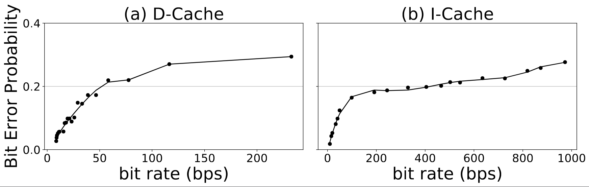
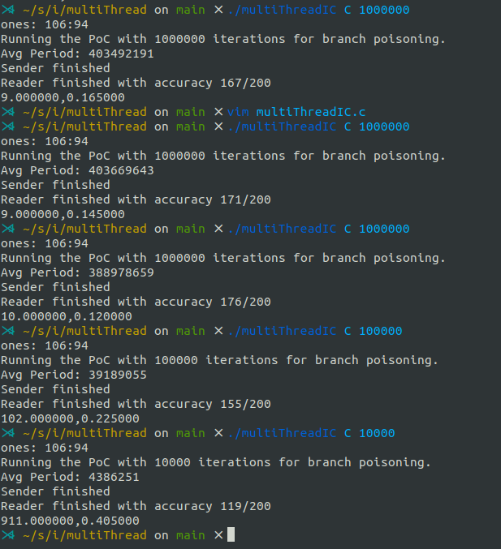
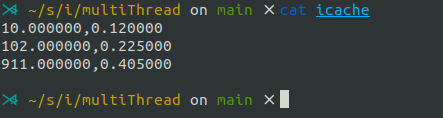

# I Cache PoC
This PoC demonstrates how limited Reservation Station entries can lead to
a timing channel attack using the I-Cache.

## Build
`make`

We need to add the current directory to `LD_LIBRARY_PATH` so that the shared
libraries are used: `export LD_LIBRARY_PATH=$PWD`

The built binary can be run on the same core (with SMT enabled) or cross cores.

## Run
Usage: `./multiThreadIC [mode] [training_loops]`
```
mode: S - The PoC runs on same physical cores (1,5)
      C - The PoC runs on different physical cores (1,2)

training_loops: program parameter which determines how many times a branch
is trained to ensure misprediction for N+1th run. A large value guarantees
misprediction but delays the bit leak period since the branches are trained for
each bit leak. A smaller value leaks the bits faster but with lower accuracy.
Default value: 1000000
```

This PoC is developed for a 8 core (4 Physical cores) machine, so the numbers
need to be changed if the mappings are different.

## Scripts
The repository contains 2 scripts to run the attack at various bit-rate leaks
and to visualize the efficiency. The `script.sh` runs the attack at various
`training_loop` values and the `parse.py` script creates a bit error probability 
against bit rates csv which is used by the `pareto.py` to generate the pareto
curves.

The scripts are run as follows:
```
$> bash script.sh > out

$> python3 parse.py > icache

$> python3 pareto.py
```

## Discussion on plots
The bash script (script.sh) runs the multiThreadIC three times for a set of 
training iterations to generate an error probability rate.

The raw output is parsed by parse.py to get the frequency and error probabilty 
into a small csv which is used by pareto.py to plot the graph as shown in (b) below.
.

The error rates vary on different systems and other system variables such as 
other processes and architectural differences. A typical set of output looks like
. 

We can see that there is variation in accuracy for a particular `training_loops` set,
 but the trend is decreasing for `training_loops` from `1000000` to `1000`. That is the 
general trend we expect to see since higher `training_loops` trains the branch in a desired 
direction longer and hence increases the probability that the mis-speculation happens 
when we try to leak the bit.

We see a decreasing accuracy as we move to lower iteration levels, but every so 
often the experiment breaks (due to background threads or irregular context switches),
which might render the particular run unviable. This can be checked by running a few 
runs with line 261 of `multiThreadIC.c` uncommented to see the leak trend. Any major 
contiguous chunk of 0s or 1s is indicative that the attack has broken significantly.

Ideally, the script.sh should produce viable plot points, but due to system we can run 
the PoC individually for certain frequencies (from higher end of 1M to 1K) to see how the
error accuracies look like.

The `icache` file can be created by copying out the last line of each run into a new file
 for use with pareto.py. As an example, we show below how a sample `icache` file is created from the 
output shown in the above runs (once per `training_loop`).
.
